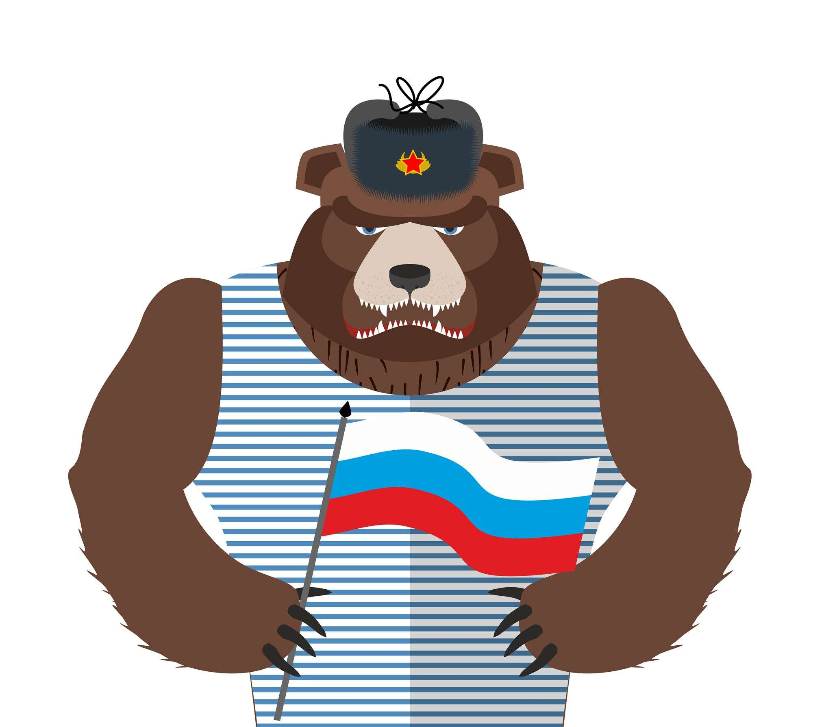

## APT29 CozyBear

Cozy Bear, classified by the United States federal government as advanced persistent threat APT29, is a Russian hacker group believed to be associated with one or more intelligence agencies of Russia. The Dutch General Intelligence and Security Service (AIVD) deduced from security camera footage that it is led by the Russian Foreign Intelligence Service (SVR); this view is shared by the United States. Cybersecurity firm CrowdStrike also previously suggested that it may be associated with either the Russian Federal Security Service (FSB) or SVR. The group has been given various nicknames by other cybersecurity firms, including CozyCar, CozyDuke (by F-Secure), Dark Halo, The Dukes (by Volexity), NOBELIUM, Office Monkeys, StellarParticle, UNC2452, and YTTRIUM.

On 20 December 2020, it was reported that CozyBear was responsible for a cyber attack on US sovereign national data, believed to be at the direction of the Russian government.

They have staged a series of precise attacks on high profile targets including the US White House, Department of State and the Democratic National Committee.

The actor hunts for confidential information stored in the networks of governmental organizations, political groups and think tanks, as well as various individuals involved in defense and geopolitical related research.
