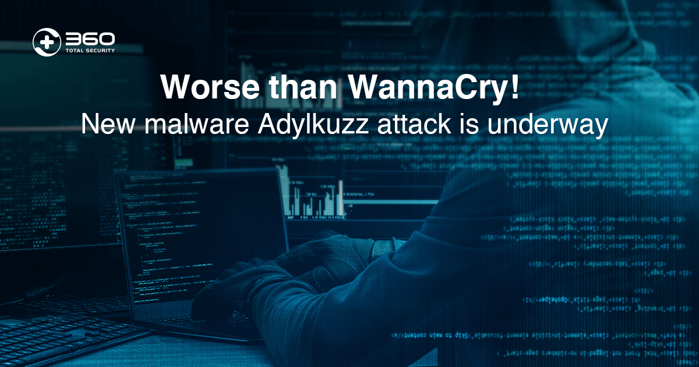
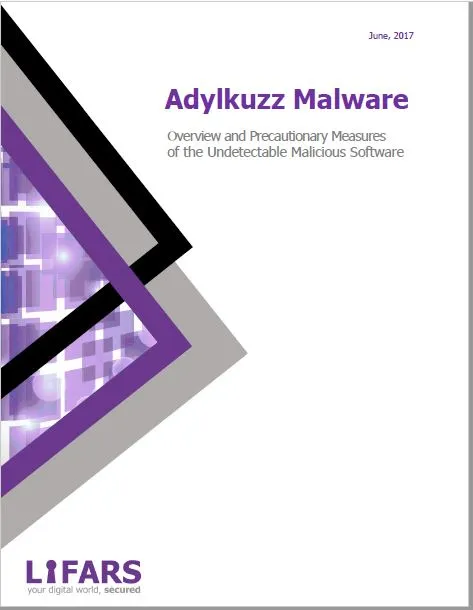
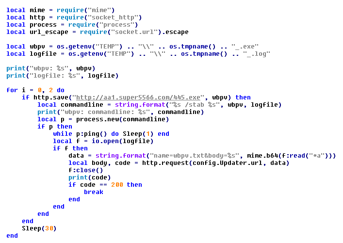

# ☠️☠️ Adylkuzz ☠️☠️ 

Adylkuzz, a cryptocurrency miner, that has been infecting PCs around the world, just like WannaCry. It exploits the infected PCs’ system resources to fuel its authors’ cryptocurrency mining operation, so it’s only focused on mining the cryptocurrency, Monero.

Although this cryptomining malware is not entirely new, its latest campaign started at a big scale. We first spotted it around midnight on April 23rd 2017, in Ukraine. Since then, preliminary statistics show that avast blocked more than 92,000 attempted attacks on users. This is not as high as the WannaCry attacks, but still a stunning amount.

What’s new and what wasn’t included in WannaCry, is that Adylkuzz tries to block other threats trying to also infect the PC using the MS17-010 vulnerability. The PC will remain infected with Adylkuzz, but the malware will actually protect the PC from other malware strains trying to use the same exploit.



## ==> Infection
           This trojan is likely to be distributed through untrustworthy software, file download sources, or spam campaigns. Some examples of channels that should NOT be used to download files or programs are: Peer-to-Peer networks (torrent clients, eMule, etc.), unofficial pages, freeware download sites or free file hosting pages, and third party downloaders.
## ==> NAME:
            Adylkuzz
            
## ==> Distribution:
            Infected email attachments, malicious online advertisements, social engineering, software 'cracks', unofficial software update tools
            
## ==> TYPE:           
            CryptoMiner

## ==> Modus Operandi:  
            Adylkuzz infects PCs the same way WannaCry does - by exploiting the MS17-010 Windows vulnerability in the Server Message Block (SMB) protocol via the EternalBlue/DoublePulsar Windows exploit. Adylkuzz’s advance is more insidious than if it were being spread via phishing-emails, because it doesn’t require user interaction to infect a system.


## ==> PAYLOAD:        
            A Monero CryptoMiner, Anti-Malware
            
## ==> TARGETS:
            Ukraine/Europe PC users
            
## ==> Key Points and Mitigation:.
```
☣️This is relatively easy to disinfect.☣️
💉Based on the settings of your AV (tested against windows defender), it will either move the file to the quarantine where it cannot spread or cause harm, or remove it.🩺
💊Companies can take steps to prevent infection, with software and AV updates being most important.
```
