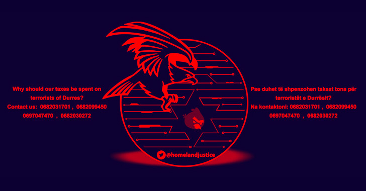

## Albania Cyber Attacks
 

## In 2015:
Apple’s official developer platform Xcode for creating OS X and iOS software, repackaged by yet unknown hackers (probably Iranian) to include malicious code. Any developer, who would download this installer and use it to compile an iOS app, would automatically include this code into their app, which is then submitted to the App Store and distributed to all users automatically as a usual update. According to Palo Alto Networks, which published a series of reports on XcodeGhost, this malware is able to collect information from mobile devices and send them to a command and control server. It would also try to phish for user’s credentials or steal their passwords from the clipboard.

Still, the most remarkable is that quite a few legitimate and popular iOS apps from well-known developers (mostly based in China) became infected and were successfully published in the App Store. Although it baffles me why a seasoned developer would download Xcode from a file-sharing site instead of getting it for free directly from Apple, the list of victims includes Tencent, creators of the hugely popular app WeChat that has over 600 million users. In total, around 40 apps in the App Store have been found to contain the malicious code. Update: another report by FireEye identifies over 4000 affected apps.

Unfortunately, there is practically nothing that iOS users can do at the moment to prevent this kind of attack. Surely, they should uninstall any of the apps that are known to contain this malicious code, but how many have not yet been discovered? We can also safely assume that other hackers will follow with their own implementations of this new concept or concentrate on attacking other components of the development chain.

## In July 2022:
 

Cybersecurity and Infrastructure Security Agency (CISA) and FBI said on Wednesday that hackers connected to Iran’s military spent 14 months inside the networks of the Albanian government before launching a ransomware attack that caused widespread damage in July.

The FBI did not specify which Iranian hacking group was behind the incident but explained that in their investigation, they found the hackers exploited an Internet-facing Microsoft SharePoint through CVE-2019-0604.

Cybersecurity agencies classified CVE-2019-0604 as one of the most exploited bugs throughout 2020 and has been abused by both nation-states and ransomware gangs. 

According to the alert, the hackers were able to maintain continuous access to the network for more than a year, frequently stealing emails throughout 2021. By May 2022, the actors began moving laterally and examining the network, performing wider credential theft across Albanian government networks. 
