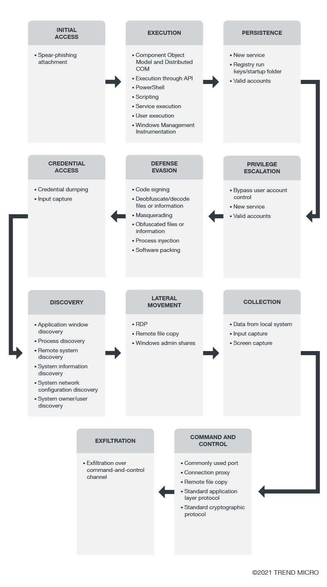

## Carbanak
 

Carbanak is an APT-style campaign targeting (but not limited to) financial institutions, that was discovered in 2014 by the Russian cyber security company Kaspersky Lab. It utilizes malware that is introduced into systems running Microsoft Windows using phishing emails, which is then used to steal money from banks via macros in documents. The hacker group is said to have stolen over 900 million dollars, from the banks as well as from over a thousand private customers.

The criminals were able to manipulate their access to the respective banking networks in order to steal the money in a variety of ways. In some instances, ATMs were instructed to dispense cash without having to locally interact with the terminal. Money mules would collect the money and transfer it over the SWIFT network to the criminals’ accounts, Kaspersky said. The Carbanak group went so far as to alter databases and pump up balances on existing accounts and pocketing the difference unbeknownst to the user whose original balance is still intact.

Their intended targets were primarily in Russia, followed by the United States, Germany, China and Ukraine, according to Kaspersky Lab. One bank lost $7.3 million when its ATMs were programmed to spew cash at certain times that henchmen would then collect, while a separate firm had $10 million taken via its online platform.

## How does carbanak work

attackers enter the system through spear phishing. After gaining a foothold in the system, the dynamic data exchange (DDE) feature in Windows and legitimate cloud-based services will then be abused to deliver the malware or to establish command-and-control (C&C) communication.

After this, the Carbanak backdoor can then be used to log keystrokes and capture screenshots, steal and delete cookies, inject malicious code on sites, and monitor various traffic. For lateral movement, the malware abuses remote and system administration tools. Successfully entering the system leads to the next step: executing the attack. For code and behavior execution, both groups use a variety of techniques through native API, PowerShell, service execution, user execution, Windows Component Object Model (COM) and Distributed COM, and Windows Management Instrumentation (WMI).

Carbanak also abuses command-line interface and DDE client-server protocol.

On the other hand, FIN7 takes advantage of Mshta, a utility that can execute VBScript, and scheduled tasks to run malicious code on user systems. Once the malicious behavior is executed, the attackers will attempt to keep their presence in a system. To maintain persistence, the groups create new services. They also add programs to a startup folder that can be referenced with a registry run key. We detected a variant of the Carbanak malware that adds registry entries and keys as an autostart technique. Credentials of existing valid accounts were also abused.

In the case of FIN7, the use of application shimming databases (which can allow developers to apply fixes to applications without rewriting code) and hooking processes that allow the modification of program behaviors are some of the techniques that can be applied. The former has been utilized in a campaign involving the Pillowmint malware. Some portions of the system are protected by credentials. To steal these, both groups employed credential dumping and input capture. The former involves credentials that are usually in the form of hash or clear text, while the latter involves API or web portals.

Carbanak also performs brute force tactics or takes advantage of credentials that are saved in web browsers.
