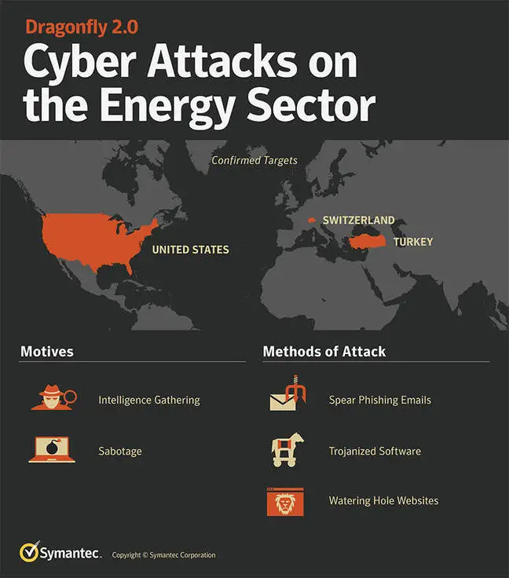

## Dragonfly, Dragonfly 2.0, (DYMALLOY, Energetic Bear, Havex, IRON LIBERTY, Koala, or TeamSpy) 

Russian cyber espionage group, sometimes known as an advanced persistent threat. According to the United States, the group is composed of "FSB hackers," either those directly employed by the FSB or Russian civilian, criminal hackers coerced into contracting as FSB hackers while still freelancing or moonlighting as criminal hackers. Four accused Berserk Bear participants, three FSB staff and one civilian, have been indicted in the United States and are regarded by the United States Department of Justice as fugitives. 
Berserk Bear specializes in compromising utilities infrastructure, especially that belonging to companies responsible for water or energy distribution.It has performed these activities in at least Germany and the U.S. These operations are targeted towards surveillance and technical reconnaissance.

Berserk Bear has also targeted many state, local, and tribal government and aviation networks in the U.S., and as of October 1, 2020, had exfiltrated data from at least two victim servers. In particular, Berserk Bear is believed to have infiltrated the computer network of the city of Austin, Texas, during 2020.

The group is capable of producing its own advanced malware, although it sometimes seeks to mimic other hacking groups and conceal its activities.

