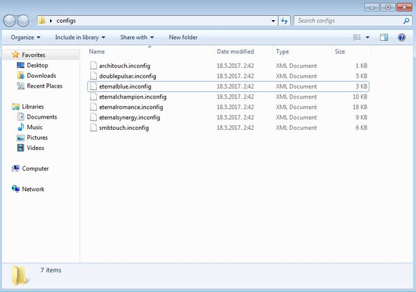
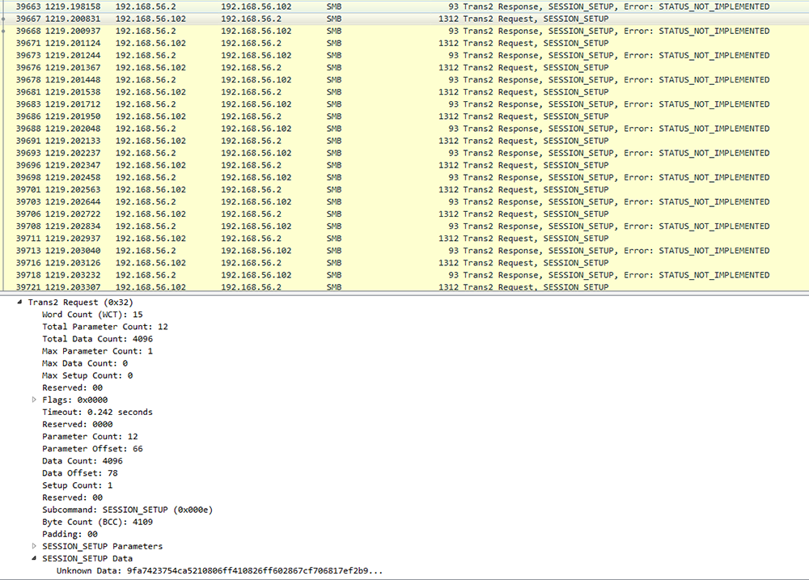
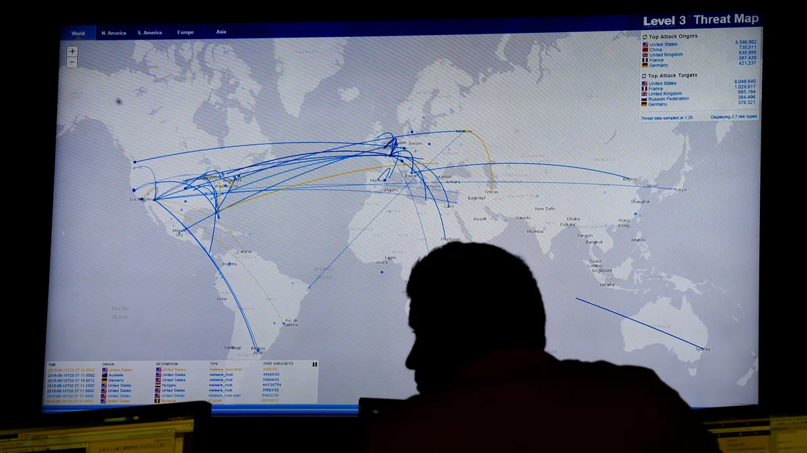

## Eternalrocks
EternalRocks (DOOMSday malware), that uses seven exploits first discovered by the National Security Agency and leaked in April 2017 by the Shadow Brokers group. Experts described the malware as a "doomsday" worm that could strike suddenly.

Earlier this month, the WannaCry ransomware plagued hospitals, schools and offices around the world and spread to more than 300,000 computers. It uses two NSA exploits that were leaked by the Shadow Brokers, EternalBlue and DoublePulsar. A few days later, researchers found Adylkuzz, new malware that spread using those same exploits and created botnets to mine for cryptocurrency.

Now, there's EternalRocks. Miroslav Stampar, a cybersecurity expert for Croatia's CERT, first discovered the hodgepodge of hacks. The earliest findings of EternalRocks goes all the way back to May 3 2016, he wrote in a description on GitHub.

EternalRocks uses EternalBlue, DoublePulsar, EternalChampion, EternalRomance, EternalSynergy, ArchiTouch and SMBTouch -- all tools leaked by the Shadow Brokers. Stampar said he found the packed hack after it infected his honeypot, a trap set to monitor incoming malware.

The majority of the tools exploit vulnerabilities with standard file sharing technology used by PCs called Microsoft Windows Server Message Block, which is how WannaCry spread so quickly without being noticed. Microsoft patched these vulnerabilities in March, but many outdated computers remain at risk.

Unlike WannaCry, which alerts victims they've been infected through ransomware, EternalRocks remains hidden and quiet on computers. Once in a computer, it downloads Tor's private browser and sends a signal to the worm's hidden servers.

Then, it waits. For 24 hours, EternalRocks does nothing. But after a day, the server responds and starts downloading and self-replicating. That means security experts who want to get more information and study the malware will be delayed by a day.

"By delaying the communications the bad actors are attempting to be more stealthy," Michael Patterson, CEO of security firm Plixer, said in an emailed statement. "The race to detect and stop all malware was lost years ago."

It even names itself WannaCry in an attempt to hide from security researchers, Stampar said. Like variants of WannaCry, EternalRocks also doesn't have a kill-switch, so it can't be as easily blocked off.

For now, EternalRocks remains dormant as it continues to spread and infect more computers. Stampar warns the worm can be weaponized at any time, the same way that WannaCry's ransomware struck all at once after it had already infected thousands of computers.

Because of its stealthy nature, it's unclear how many computers EternalRocks has infected. It's also unclear what EternalRocks will be weaponized into. Plixer said the worm could be immediately turned into more ransomware or trojan attacks for banking.
