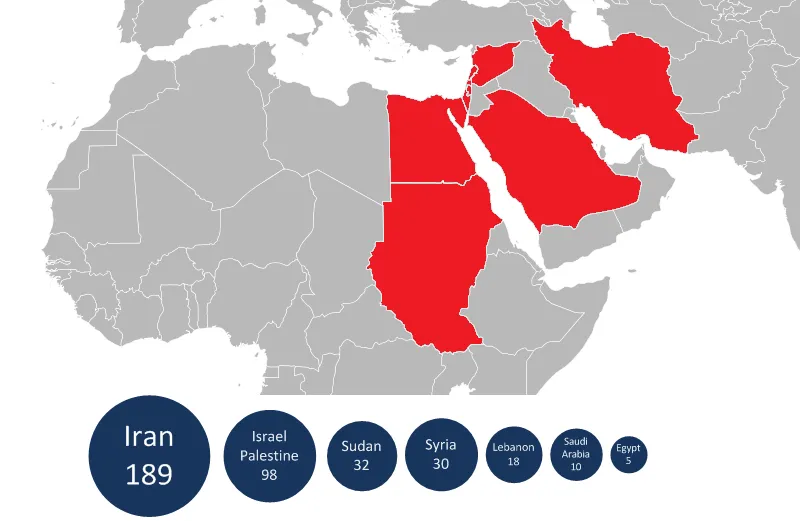
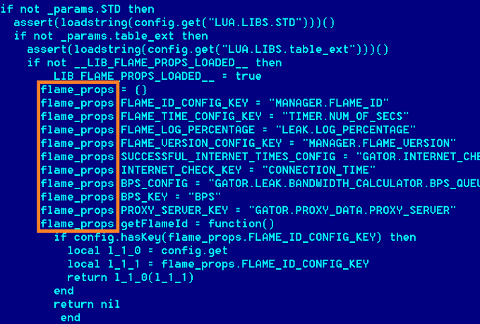

# Flame Group malware
    Flame, also known as Flamer, sKyWIper, and Skywiper;
    a modular computer malware discovered in 2012 that attacks computers running the Microsoft Windows operating system. 
    The program is used for targeted cyber espionage in Middle Eastern countries

Flame is an uncharacteristically large program for malware at 20 megabytes. It is written partly in the Lua scripting language with compiled C++ code linked in, and allows other attack modules to be loaded after initial infection. The malware uses five different encryption methods and an SQLite database to store structured information. The method used to inject code into various processes is stealthy, in that the malware modules do not appear in a listing of the modules loaded into a process and malware memory pages are protected with READ, WRITE and EXECUTE permissions that make them inaccessible by user-mode applications. The internal code has few similarities with other malware, but exploits two of the same security vulnerabilities used previously by Stuxnet to infect systems.

Like the previously known cyber weapons Stuxnet and Duqu, it is employed in a targeted manner and can evade current security software through rootkit functionality. Once a system is infected, Flame can spread to other systems over a local network or via USB stick. It can record audio, screenshots, keyboard activity and network traffic. The program also records Skype conversations and can turn infected computers into Bluetooth beacons which attempt to download contact information from nearby Bluetooth enabled devices. This data, along with locally stored documents, is sent on to one of several command and control servers that are scattered around the world. The program then awaits further instructions from these servers.

    Unlike Stuxnet, which was designed to sabotage an industrial process, 
    Flame appears to have been written purely for espionage. 
    It does not appear to target a particular industry, but rather is 
    "a complete attack toolkit designed for general cyber-espionage purposes"

