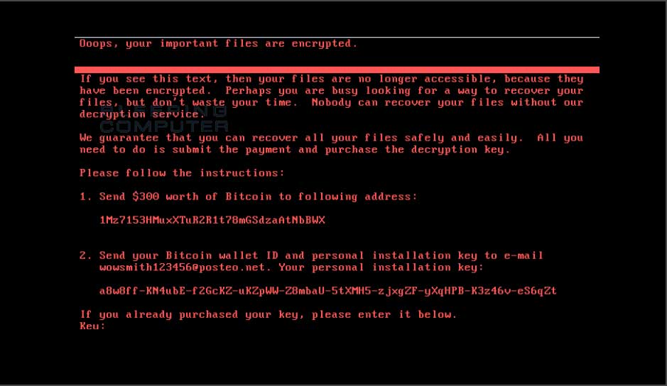
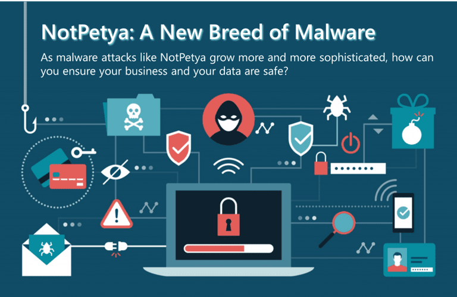

# ☠️☠️ NOTPETYA RANSOMWARE ☠️☠️ 
 



A series of powerful cyberattacks using the Petya malware began on 27 June 2017 that swamped websites of Ukrainian organizations, including banks, ministries, newspapers and electricity firms. Similar infections were reported in France, Germany, Italy, Poland, Russia, United Kingdom, the United States and Australia. 

NotPetya accidentally took down global shipping giant Maersk
Sandworm ad hijacked the firm's update servers early in 2017, and this gave them back-door access to the thousands of computers running M.E.Doc. That June, Sandworm released a particularly vicious cyberweapon called NotPetya, which spread rapidly and automatically. The business interruption to Maersk, the world's largest container ship and supply vessel operator, was estimated between $200m and $300m in lost revenues. The business impact on FedEx is estimated to be $400m in 2018, according to the company's 2019 annual report.

## HOW DOES IT WORK


## ==> TYPE:           
            NotPetya was a modified version of Petya, using two known exploits for older Windows versions: EternalBlue and Mimikatz. The former is a digital skeleton key that was disclosed in a catastrophic NSA data breach in early 2017. It enables outsiders remote access to run their own code. 

## ==> Modus Operandi:  
            Considered a network worm because it also includes a transport mechanism to automatically spread itself. This transport code scans for vulnerable systems, then uses the EternalBlue exploit to gain access, and the DoublePulsar tool to install and execute a copy of itself.

## ==> Language:        
            Petya versions 1, and 2 were created using Microsoft Visual C/C++
            
## ==> Key Points and Mitigation:
```
☣️Like most ransomware, Petya is difficult to remove after it has infected a system. In most cases, the victim has to decide whether to pay the ransom (in hopes of actually getting the encryption key) or erasing everything and restoring it from backup. The best approach to avoid ransomware alltogether. Here’s what to do before, during and after an attack.☣️

It was found that it may be possible to stop the encryption process if an infected computer is immediately shut down when the fictitious chkdsk screen appears, and a security analyst proposed that creating read-only files named perfc and/or perfc.dat in the Windows installation directory could prevent the payload of the current strain from executing.

1. 💉Before the Attack
  - Back up and restore
  - Update and patch
  - create a file “C:\Windows\perfc. dat”.
  - Train and educate users
  
2. 💊During the Attack
  - Turn the computer off and disconnect from the network
  - founders of TrustedSec and Binary Defense, reveal administrators can stop NotPetya from writing/executing by creating a file “C:\Windows\perfc. dat”. Use this. Just confirmed it stops execution.
  - create a file “C:\Windows\perfc. dat”.
  
3. 💊After the Attack 🩺
   - Review and Reinforce
     I recommend a top-to-bottom security assessment to find threats that may still linger in your environment. Take a hard look at your security tools and procedures—and where they fell short.

   - Cleanup
     Some ransomware contains other threats or backdoor Trojans that can lead to future attacks. In other cases, the victim’s environment was already compromised, opening a door for the ransomware. Look closer for hidden threats that you may have overlooked in the chaos.
    
   - Post-mortem review
     Review your threat preparedness, the chain of events that led to the infection, and your response. Without figuring out how the ransomware attack go through, you have no way of stopping the next attack.
     
   - Assess user awareness
    A well-informed employee is your last line of defense. Make sure employees, staff or faculty are up to the task.
    Education and training. Create a crisis communications plan in the event of a future attack, and follow-up with drills and penetration testing.
    
   - Reinforce your defenses
    Today’s fast-changing threat landscape requires security solutions that can analyze, identify and block—in real time—the malicious URLs and attachments that serve as ransomware’s primary attack vehicles.

```


