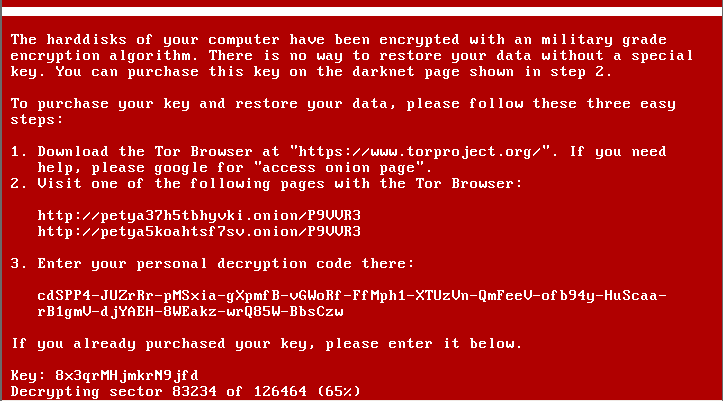
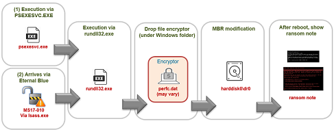

# ☠️☠️ PETYA RANSOMWARE ☠️☠️ 
  



Though first discovered in 2016, Petya began making news in 2017 when a new variant was used in a massive cyberattack against Ukrainian targets. It quickly spread worldwide, crippling businesses and causing more than $10 billion in damages.

## HOW DOES IT WORK


## ==> TYPE:           
            Ransomware Cryptoworm 

## ==> Modus Operandi:  
            Considered a network worm because it also includes a transport mechanism to automatically spread itself. This transport code scans for vulnerable systems, then uses the EternalBlue exploit to gain access, and the DoublePulsar tool to install and execute a copy of itself.

## ==> Language:        
            Petya versions 1, and 2 were created using Microsoft Visual C/C++
            
## ==> Key Points and Mitigation:
```
☣️Like most ransomware, Petya is difficult to remove after it has infected a system. In most cases, the victim has to decide whether to pay the ransom (in hopes of actually getting the encryption key) or erasing everything and restoring it from backup. The best approach to avoid ransomware altogether. Here’s what to do before, during and after an attack.☣️

1. 💉Before the Attack
  - Back up and restore
  - Update and patch
  - Train and educate users
  
2. 💊During the Attack
  - Turn the computer off and disconnect from the network
  - Call law enforcement
  - Determine scope of problem based on threat intelligence
  - Orchestrate a responseDon’t count on free ransomware decryption tools
  - Restore from Backup
  
3. 💊After the Attack 🩺
   - Review and Reinforce
     I recommend a top-to-bottom security assessment to find threats that may still linger in your environment. Take a hard look at your security tools and procedures—and where they fell short.

   - Cleanup
     Some ransomware contains other threats or backdoor Trojans that can lead to future attacks. In other cases, the victim’s environment was already compromised, opening a door for the ransomware. Look closer for hidden threats that you may have overlooked in the chaos.
    
   - Post-mortem review
     Review your threat preparedness, the chain of events that led to the infection, and your response. Without figuring out how the ransomware attack go through, you have no way of stopping the next attack.
     
   - Assess user awareness
    A well-informed employee is your last line of defense. Make sure employees, staff or faculty are up to the task.
    Education and training. Create a crisis communications plan in the event of a future attack, and follow-up with drills and penetration testing.
    
   - Reinforce your defenses
    Today’s fast-changing threat landscape requires security solutions that can analyze, identify and block—in real time—the malicious URLs and attachments that serve as ransomware’s primary attack vehicles.

```

