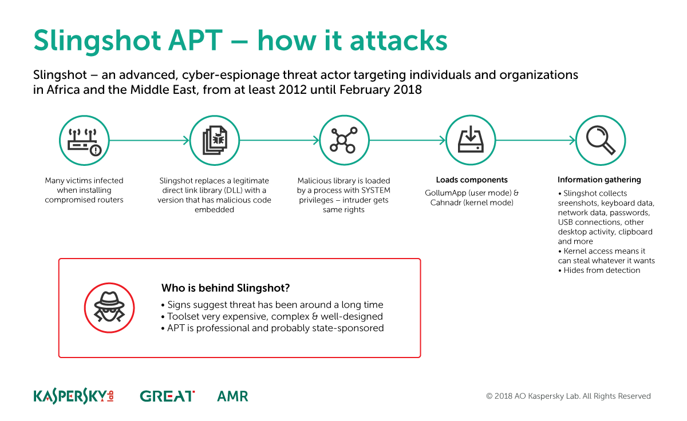

# Slingshot: the spy that came in from the router 
 

    The Slingshot operation was discovered after researchers found a suspicious keylogger program 
    and created a behavioral detection signature to see if that code appeared anywhere else. 
    This triggered a detection that turned out to be an infected computer with a suspicious file inside the system folder named scesrv.
    Slingshot is very complex and the developers behind it have clearly spent a great deal of time and money on its creation. 
    Its infection vector is remarkable.
    most of the victims observed appeared to have been initially infected through a Windows exploit or compromised Mikrotik routers.
