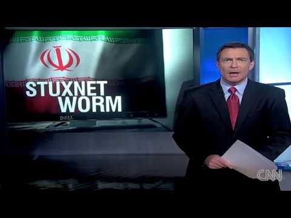

## STUXNET: The beginning of the Cyber World war

Stuxnet is a powerful and malicious computer worm that first surfaced in 2010. It is also reportedly the largest and costliest of this type of malware. It exploited the previously unknown Windows zero-day vulnerabilities to infect target systems and spread to other systems. While no country has officially admitted to creating Stuxnet, it is widely believed that the US and Israel jointly developed the worm. Stuxnet was the first virus to cause the physical destruction of infected devices. It severely crippled Iran's nuclear program, though the malware also accidentally spread beyond the limits of Iran's nuclear facilities due to its aggressive nature. 

