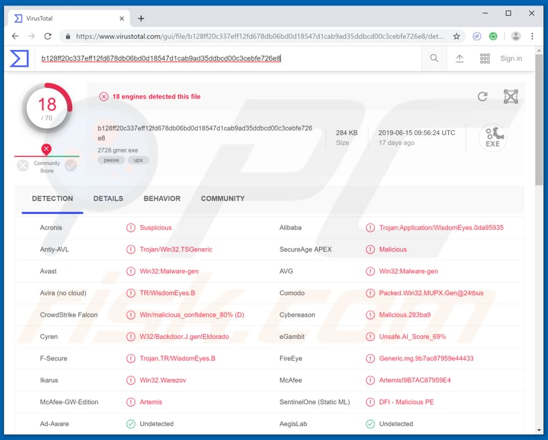
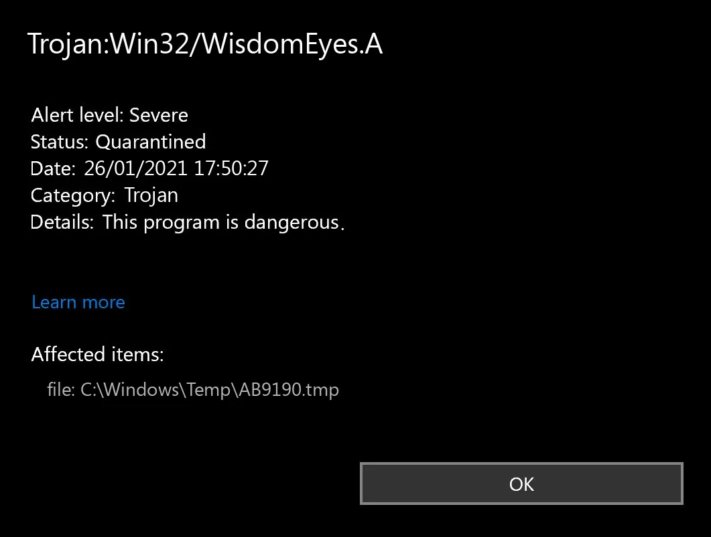

# ☠️☠️ WIN32/Wisdomeyes ☠️☠️ 


Wisdomeyes (Win32/Wisdomeyes) is malicious software that can hijack browsers (changing the settings), download and install other malicious programs, steal private information, display advertisements, create unwanted tasks, and modify system files.

It can seriously damage operating systems and cause problems for regular computer users.


## ==> Infection
           This trojan is likely to be distributed through untrustworthy software, file download sources, or spam campaigns. Some examples of channels that should NOT be used to download files or programs are: Peer-to-Peer networks (torrent clients, eMule, etc.), unofficial pages, freeware download sites or free file hosting pages, and third party downloaders.
## ==> NAME:
            Win32/Wisdomeyes trojan
            
## ==> Distribution:
            Infected email attachments, malicious online advertisements, social engineering, software 'cracks', unofficial software update tools
            
## ==> TYPE:           
            Trojan, Password-stealing virus, Banking malware, Spyware

## ==> Modus Operandi:  
            hijack browsers (changing the settings), download and install other malicious programs, steal private information, display advertisements, create unwanted tasks, and modify system files.
            
## ==> PAYLOAD:        
            Info stealer, keylogger, backdoor trojan, browser hijacker, adware
            
## ==> TARGETS:
            Stolen banking information, passwords, identity theft, unwanted ads and tasks, modified system files.
            
## ==> Key Points and Mitigation:.
```
☣️This Trojan is relatively easy to disinfect.☣️
💉Based on the settings of your AV (tested against windows defender), it will either move the file to the quarantine where it cannot spread or cause harm, or remove it.🩺
💊Companies can take steps to prevent infection, with software and AV updates being most important.
```


