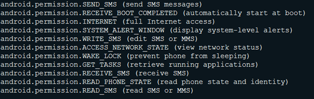

# mazar bot android malware

    Discovered in early 2016, Mazar Bot is spread by sending SMS text messages, via a URL shortener service. 
    Mazar Bot targeted multiple banks specifically in the German-Austrian region according to attacks that were encountered in early July 2017.
    This malware, seen on Android devices, permits itself to access the following device permissions

