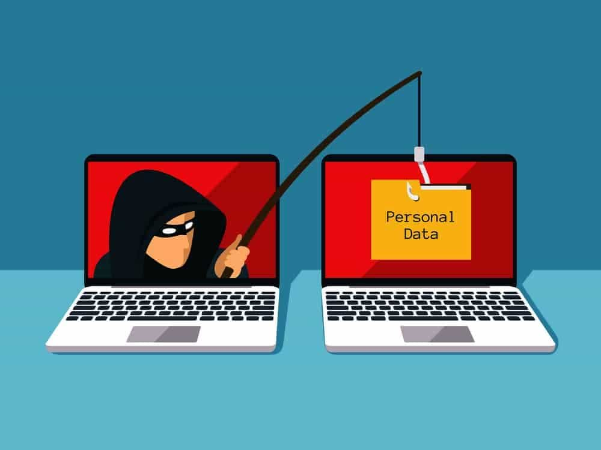
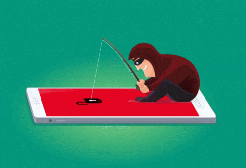

# <h1 align="center"> Phish 'em all </h1>

    👉 These are exact replicas of real world platforms. 
    👉 Why...? Well, If you wish to get the Google credentials of a target, this is your best option. 
    👉 A replica of a google login page can be sent to the target and when they try to login with their legit google credentials...BAM! 
    👉You got them. Dont do that though unless for educational purposes and with explicit permission from the target. 

